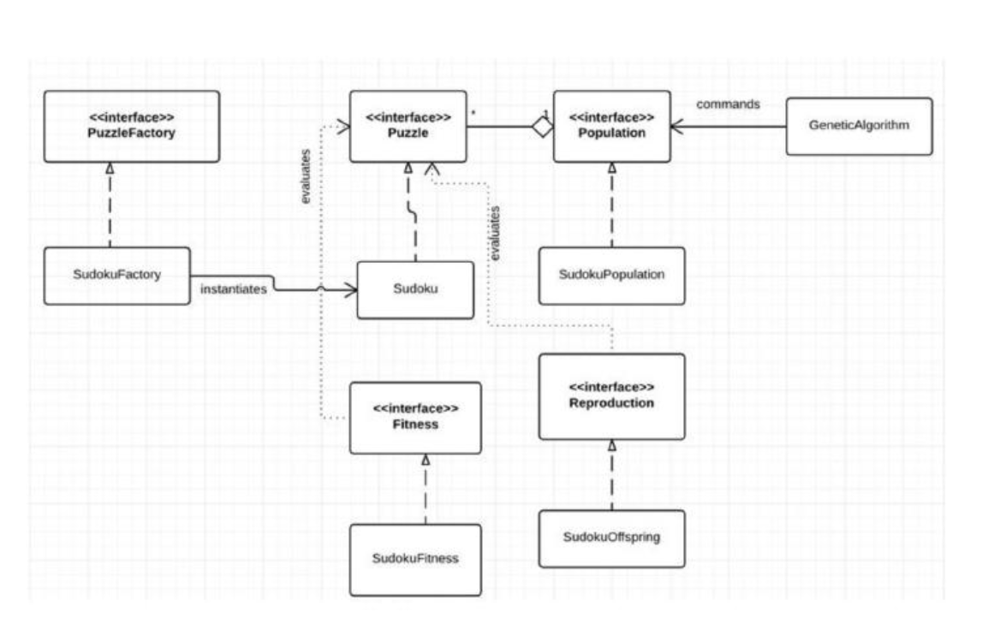

# puzzle-solver

### Sudoku Puzzles
Sudoku is a logic-based, combinatorial number-placement puzzle. In classic sudoku, the objective is to fill a 9×9 grid with digits so that each column, each row, and each of the nine 3×3 sub-grids that compose the grid (also called "boxes", "blocks", or "regions") contain all digits from 1 to 9. The puzzle setter provides a partially completed grid, which for a well-posed puzzle has a single solution.

Completed games are always an example of a Latin square, including an additional constraint on the contents of individual regions. For example, the same single integer may not appear twice in the same row, column, or any of the nine 3×3 subregions of the 9×9 playing board.

### Genetic Programming
Genetic programming is a domain-independent method that genetically breeds a population of computer
programs to solve a problem. Specifically, genetic programming iteratively transforms a population of
computer programs into a new generation of programs by applying analogs of naturally occurring genetic
operations. The genetic operations include crossover (sexual recombination), mutation, reproduction, gene duplication, and gene deletion.
Genetic programming typically starts with a population of randomly generated computer programs
composed of the available programmatic ingredients. Genetic programming iteratively transforms a
population of computer programs into a new generation of the population by applying analogs of naturally occurring genetic operations. These operations are applied to individual(s) selected from the population. The individuals are probabilistically selected to participate in the genetic operations based on their fitness (as measured by the fitness measure provided by the human user in the third preparatory step). The iterative transformation of the population is executed inside the main generational loop of the run of genetic programming. The flowchart below illustrates the execution of genetic programming.

### The purpose of this program is to design and implement a set of classes that define the abstractions
necessary to solve puzzles of any kind using the genetic programming approach (GA).

### Detailed design document can be found [here](https://github.com/huyn8/puzzle-solver/blob/819c24a66bdc1ff639f6a6bfd07d0864ceec7fc9/puzzle-solver-source-code/Design%20Documentation.pdf)

### UML

## Program was compiled and run via Visual Studio Community Edition 
